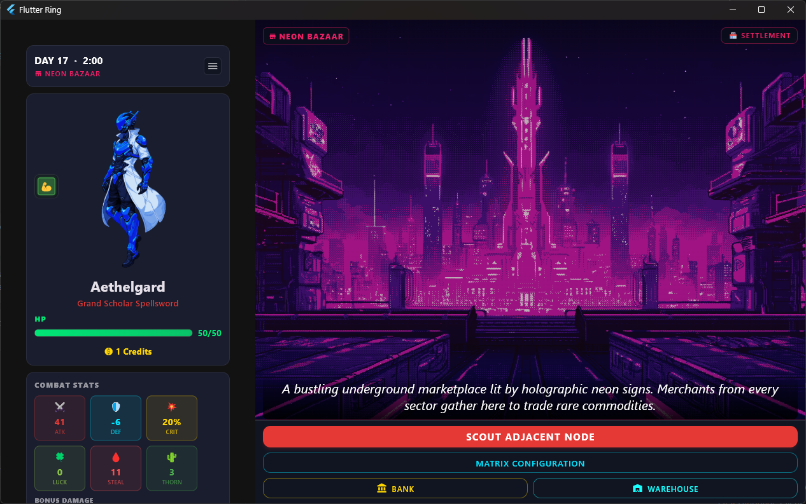
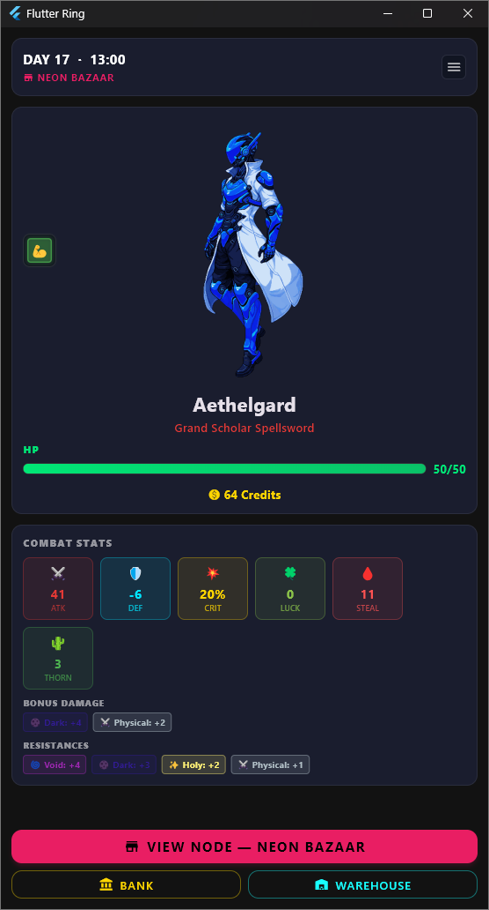
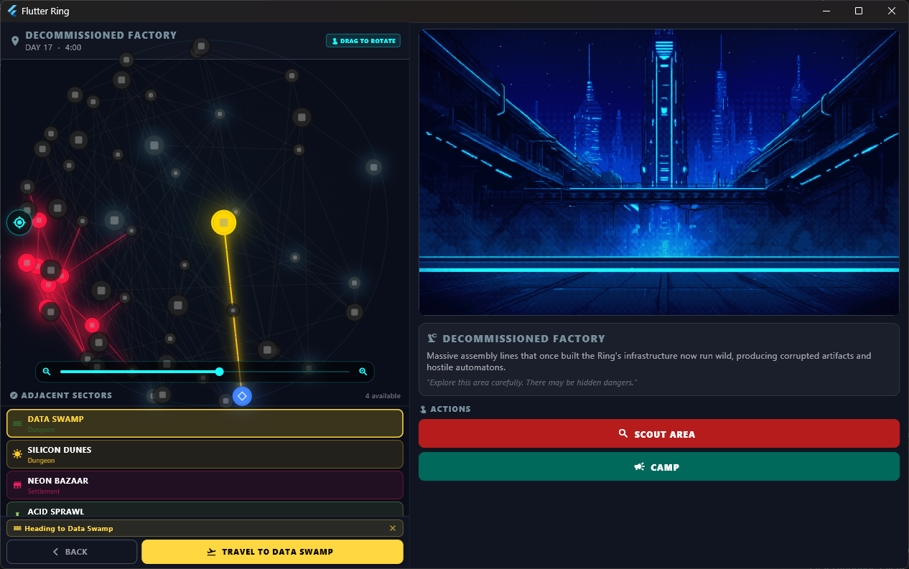
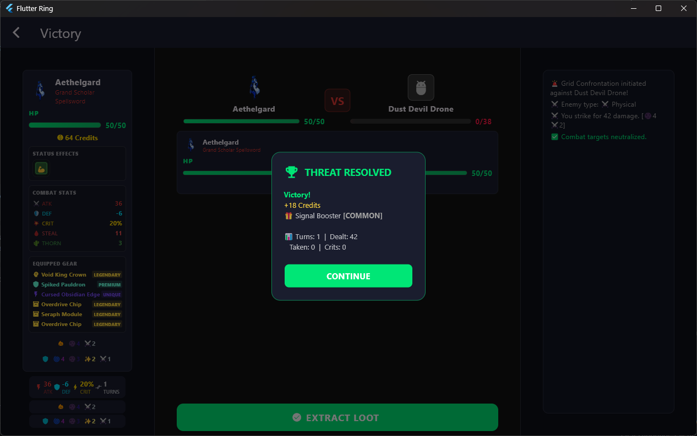
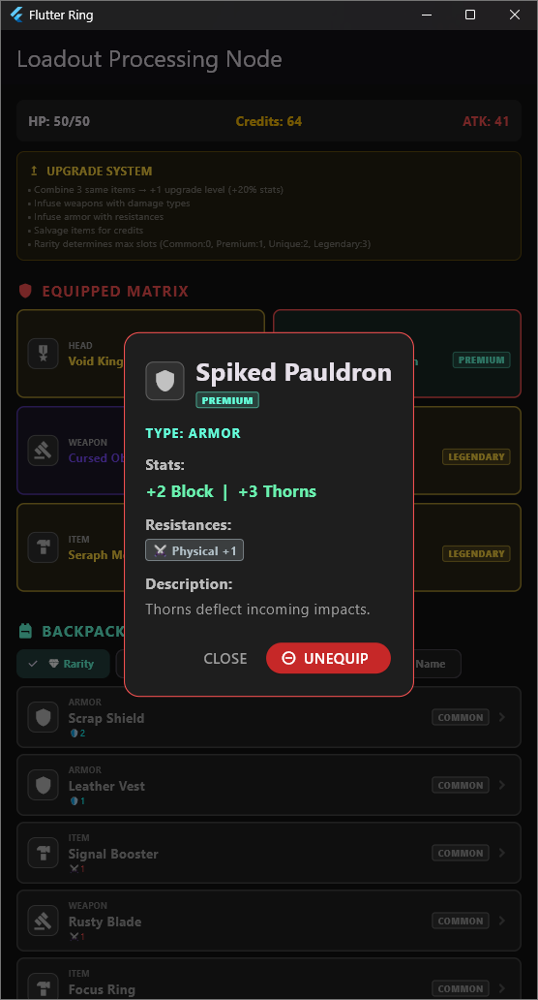
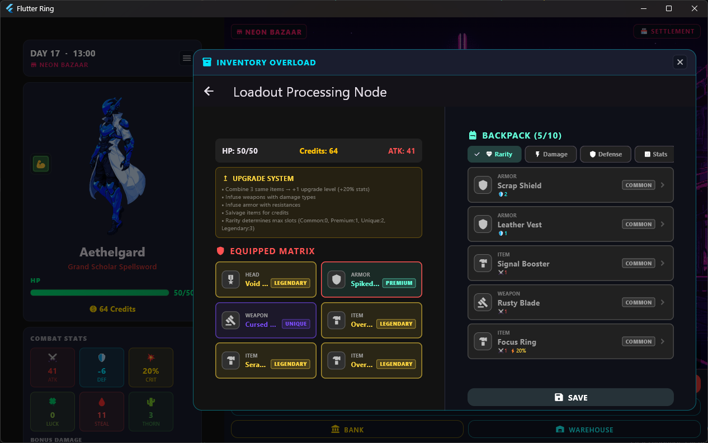
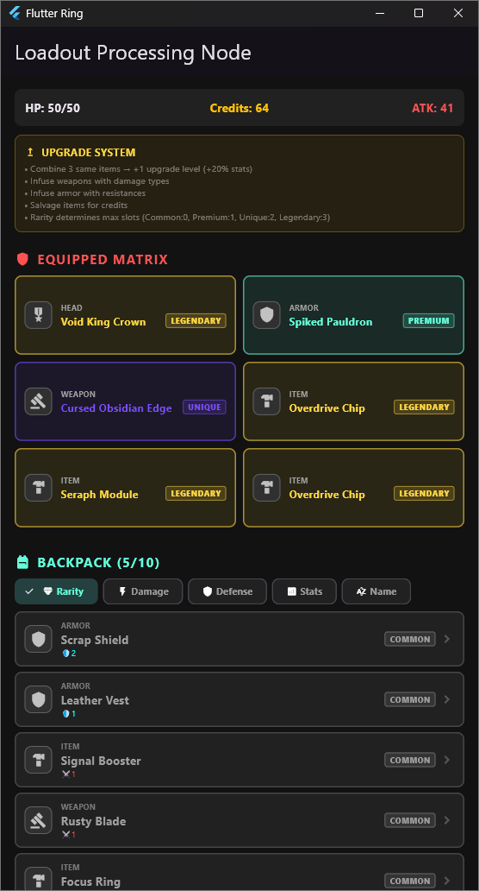

# Flutter Ring

> **A cyberpunk text-adventure RPG built with Flutter** — explore a digital world of 60+ zones, battle corrupted data-beasts, collect legendary gear, and survive the endless cycle of the Ring.

[](https://flutter.dev/)
[](https://dart.dev/)
[](https://supabase.com/)
[](LICENSE)

---

## 📖 Description

**Flutter Ring** is a cyberpunk-themed text-adventure RPG where you play as a **data-runner** navigating a vast, interconnected digital realm known as **the Ring**. Starting from the neon-lit **Data-Town Hub**, you'll venture through forests of fractal code, abandoned server-farms, quantum rifts, and volcanic processing cores — each zone teeming with corrupted enemies, hidden merchants, mysterious NPCs, and random events.

The game blends classic roguelike progression with modern RPG systems:

- **Choose your runner** from 4 distinct character classes, each with unique equipment slot layouts and playstyles.
- **Explore 60+ zones** on a world map, each with its own description, theme, and connections to neighboring regions.
- **Battle enemies** in turn-based combat featuring 8 damage types, elemental resistances, and critical strikes.
- **Confront 10 weekly bosses** — each with a unique mechanic (damage reflection, burn, freeze, chain strikes, shields, and more). Every 7 in-game days, a **Hyper Boss** automatically ambushes you in settlements.
- **Collect and upgrade gear** across 4 rarity tiers (Common → Legendary), with upgrade levels 0–5 that scale all stats by 20% per level.
- **Manage status effects** — 20 total (11 negative like Poison, Burn, Bleeding, Corruption, Madness; 9 positive like Regeneration, Shield Aura, Blessed, Empowered, Life Steal).
- **Interact with a living world** — random travel events with stat-check choices, camp events, rotating traveling merchants, and NPC doctors who can cure your ailments.
- **Store your loot** in a personal Bank and shared Warehouse, accessible from settlements.
- **Save locally or sync to the cloud** via Supabase with Google Sign-In authentication.
- **Play anywhere** — fully responsive layout supports portrait and landscape on mobile, plus desktop (Windows/Linux/macOS) and web.

---

## 🖼️ Showcase

### Main Screen — Landscape



### Main Screen — Portrait



### Travel & World Map



### Battle System



### Item Effects & Status Display



### Responsive Layout — Landscape



### Responsive Layout — Portrait



---

## ✨ Features

### 🎮 Core Gameplay
- **4 unique character classes** with different slot layouts and starting stats
- **60+ zones** on an interconnected world map with settlements, dungeons, and hazards
- **Turn-based combat** with 8 elemental damage types and unique proc effects
- **10 weekly bosses** with signature mechanics, plus **Hyper Bosses** every 7 days
- **Random events** during travel with stat-check choices and multiple outcomes
- **Camp events** with guaranteed encounters and hourly effect processing

### ⚔️ Combat System
- **8 Damage Types**: Physical, Fire, Ice, Lightning, Poison, Void, Holy, Dark
- Each damage type has a unique combat proc (Sunder, Ignite, Deep Freeze, Chain Strike, Venom, Rift, Judgment, Leech)
- **Elemental resistances** and **immunities** on enemies
- **Critical strike** system with luck-based scaling
- **Boss mechanics**: damage reflection, burn, freeze, chain strikes, poison, max-HP drain, healing, enrage, type-shifting, shields

### 💎 Item & Progression System
- **4 Rarity Tiers**: Common, Premium, Unique, Legendary
- **Item upgrades** (0–5 levels) — each level boosts stats by 20%
- **Equipment slots**: Head, Armor (dual-slot), Weapon (dual/triple-slot), Consumable/Item
- **Consumable items** with healing and threshold-based effects
- **Auto-equip** system that intelligently slots found gear

### 🧪 Status Effects
- **11 Negative Effects**: Poison, Burn, Bleeding, Cursed, Weakened, Frozen, Paralyzed, Corruption, Vulnerability, Madness
- **9 Positive Effects**: Regeneration, Shield Aura, Blessed, Empowered, Hasted, Lucky Bonus, Resistance Boost, Life Steal Aura
- **3 Cure Methods**: Resting/Camping, Doctor visits, Gambling at GLEED, Kill-specific-enemy, Special actions
- Hourly tick processing for damage-over-time and healing-over-time effects

### 🏪 World Interactions
- **6 Merchant types** with rotating stock: Nano Pharmacist, Stim Dealer, Med Vendor, Blade Smith, Armor Forger, Void Antiquarian
- **NPC doctors** (GLEED) who can gamble-cure cursed status effects
- **Bank** — deposit/withdraw credits with daily interest
- **Warehouse** — shared storage across settlements (10+ slots)
- **Shop stock** refreshes every 24 in-game hours

### 💾 Save System
- **Local saves** with multiple save slots
- **Cloud sync** via Supabase (optional, requires Google Sign-In)
- **Auto-save** on key actions (travel, battle end, events, inventory changes)
- **Manual save** from the main screen menu
- Guest play mode (no account required)

### 📱 Platform Support
- **Mobile**: Portrait and landscape with responsive layout
- **Desktop**: Windows, Linux, macOS (via `window_manager` package)
- **Web**: Full browser support
- **Orientation lock**: All four orientations supported

---

## 🎯 Game Systems

### Character Classes

| Character | Class | HP | Attack | Credits | Slots | Playstyle |
|-----------|-------|----|--------|---------|-------|-----------|
| **Valerie** | Dual-Wield Vanguard | 65 | 7 | 10 | Head, Armor, Weapon×2, Item×2 | Balanced fighter with dual weapon slots. High HP, moderate damage. |
| **Aethelgard** | Grand Scholar Spellsword | 50 | 5 | 45 | Head, Armor, Weapon, Item×3 | Glass cannon with three item slots for maximum stat stacking. |
| **Vex** | Voidblade Assassin | 40 | 9 | 20 | Head, Armor, Weapon×3, Item | Pure aggression with triple weapon slots. Highest base attack. |
| **Bulwark** | Ironclad Sentinel | 85 | 4 | 25 | Head, Armor×2, Weapon, Item×2 | The unbreakable wall. Highest HP with dual armor slots. |

### Weekly Bosses

| Week | Boss | Damage Type | Mechanic |
|------|------|-------------|----------|
| 1 | CIPHER SENTINEL | Physical | Damage Reflection (20%) |
| 2 | INFERNO CORE | Fire | Burn (4 dmg/turn) |
| 3 | FROST WRAITH | Ice | Deep Freeze |
| 4 | VOLT REAVER | Lightning | Chain Strike |
| 5 | PLAGUE HEART | Poison | Poison AoE |
| 6 | VOID WEAVER | Void | Max HP Drain |
| 7 | BLOOD ORACLE | Dark | Healing + Enrage |
| 8 | STORM HERALD | Lightning | Type Shifting |
| 9 | CRYSTAL MAIDEN | Ice | Shield Absorption |
| 10 | NULL PROTOCOL | Void | Corruption Spread |

Every 7 days, a **Hyper Boss** (enhanced version) automatically ambushes the player when in a settlement.

### World Zones

The Ring is divided into **60+ zones** across multiple tiers of difficulty:

- **Tier 1 (Safe)**: Data-Town Hub, Rusthaven Outpost, Apex Citadel, Neon Bazaar, Iron Harbor, Chrome Spire, Neon Oasis, Black Market Hub, Sky Dock
- **Tier 2 (Moderate)**: Binary Brush, The Static Wasteland, Tech-Graveyard, Deep Memory Caves, Data Swamp, Decommissioned Factory, Silicon Dunes, Deep Net Ocean, Crystal Mines, Neural Garden, Circuit Marshes, Echo Caverns, Data Torrent, Decayed Grid
- **Tier 3 (Dangerous)**: The Digital Abyss, Core Meltdown, Void Shrine, Chrome Docks, Data Nexus, Ghost Terminal, Solar Forge, Plasma Fields, Obsidian Spire, Void Gate, Rust Canyon, Scorched Pipeline, Shattered Core, Forgotten Server, Acid Sprawl, Hollow Network, Static Rift, Dead Signal
- **Tier 4 (Endgame)**: Entropy Well, Chrome Labyrinth, Void Nexus, Deep Spire, Quantum Sea, Tachyon Faultline, Resonance Fault, Sanguine Conduit, Phasm Mirage, Zero-G Vault, Cryo-Compile Crypt, High-Forge Matrix

---

## 🚀 How to Run

### Prerequisites

- **Flutter SDK** 3.12.2 or later
- **Dart** 3.12.2 or later
- **Android Studio** (for Android emulator) or **Xcode** (for iOS) — optional, for mobile testing
- A **Supabase account** (only needed for cloud save features; the game works fully offline as a guest)

### Installation

```bash
# 1. Clone the repository
git clone https://github.com/WhichGesundheit/Flutter-Ring.git
cd Flutter-Ring

# 2. Install dependencies
flutter pub get

# 3. Run the app
flutter run
```

### Running on Specific Platforms

```bash
# Mobile (Android)
flutter run -d android

# Mobile (iOS)
flutter run -d ios

# Desktop (Windows)
flutter run -d windows

# Desktop (Linux)
flutter run -d linux

# Desktop (macOS)
flutter run -d macos

# Web
flutter run -d chrome
```

### Desktop Window Configuration

On desktop platforms, the game opens with a default window size of **1280×800** with a minimum size of **570×300**. The window is centered and resizable.

### Cloud Save Setup (Optional)

Cloud sync requires a Supabase project. The game is pre-configured with a Supabase URL and publishable key. To use your own:

1. Create a project at [supabase.com](https://supabase.com)
2. Enable **Google Sign-In** in the Authentication provider settings
3. Set up the `runs` table with appropriate columns (see `CloudSyncService` for schema)
4. Update the URL and key in `lib/main.dart`

---

## 🎮 Gameplay Guide

### Core Loop
1. **Start a run** — Choose a character class and enter the world
2. **Travel** — Move between zones on the world map (costs in-game hours)
3. **Encounter** — Battle enemies, find loot, meet merchants, or trigger events
4. **Loot & Upgrade** — Collect gear, upgrade items, manage your inventory (max 10 slots)
5. **Progress** — Defeat bosses, survive weekly hyper-boss ambushes, explore deeper zones
6. **Save & Continue** — Auto-saves on key actions; manually save from the main menu

### Combat Tips
- **Match damage types** to enemy weaknesses — each enemy has immunities and resistances
- **Status effects matter** — negative effects like Poison and Burn deal damage over time; positive effects like Regeneration and Shield Aura can turn the tide
- **Cursed status** can only be cured by gambling at GLEED's den — a risky but necessary visit
- **Bosses have unique mechanics** — study each boss's pattern before committing to an attack
- **Life Steal** and **Thorns** on gear provide sustainable survivability

### Inventory Management
- **10-slot inventory limit** — when full, you must salvage an existing item to make room
- **Auto-equip** — found items automatically equip to matching empty slots
- **Upgrade items** at settlements (coming soon) or via crafting
- **Bank** — store excess credits with daily interest
- **Warehouse** — shared storage accessible from any settlement

### Status Effect Curing
| Cure Method | How To Use |
|-------------|------------|
| **Resting** | Rest at camp or in a settlement — cures Poison, Burn, Bleeding, Weakened, Paralyzed, Vulnerability, Madness |
| **Doctor** | Visit GLEED or town doctors for medical curing |
| **Gambling** | Gamble at GLEED's den to cure the **Cursed** effect |
| **Kill Specific Enemy** | Defeat the required number of enemies to cure **Corruption** |
| **Battle Ends** | Temporary effects (Frozen, Regeneration, Shield Aura, etc.) expire automatically |

---

## 🏗️ Architecture

```
flutter_game/
├── lib/
│   ├── main.dart              # App entry point, GameController (state management)
│   ├── models/                # Game data models
│   │   ├── character.dart     # Player character with status effect system
│   │   ├── item.dart          # Items, rarities, slot types, upgrade system
│   │   ├── enemy.dart         # Enemies with boss mechanics & damage types
│   │   ├── boss.dart          # 10 weekly bosses + hyper boss scaling
│   │   ├── enemy_pool.dart    # Standard enemy definitions per zone
│   │   ├── zone.dart          # 60+ zones with world map & connections
│   │   ├── merchant.dart      # Traveling merchants with rotating stock
│   │   ├── npc.dart           # NPC managers and rotation
│   │   ├── random_event.dart  # Travel events with stat checks
│   │   ├── camp_event.dart    # Camping events
│   │   ├── status_effect.dart # 20 status effects with cure methods
│   │   └── damage_type.dart   # 8 elemental damage types
│   ├── screens/               # UI screens (one per game state)
│   │   ├── login_screen.dart
│   │   ├── save_manager_screen.dart
│   │   ├── character_select_screen.dart
│   │   ├── main_screen.dart
│   │   ├── travel_screen.dart
│   │   ├── battle_screen.dart
│   │   ├── shop_screen.dart
│   │   ├── loot_screen.dart
│   │   ├── inventory_screen.dart
│   │   ├── bank_screen.dart
│   │   ├── warehouse_screen.dart
│   │   ├── node_screen.dart
│   │   ├── gleed_screen.dart
│   │   ├── event_screen.dart
│   │   ├── game_over_screen.dart
│   │   ├── map_screen.dart
│   │   └── start_screen.dart
│   ├── services/              # Backend services
│   │   ├── save_file_manager.dart   # Local save/load (JSON)
│   │   ├── cloud_sync_service.dart  # Supabase cloud sync
│   │   └── auth_service.dart        # Google Sign-In & guest auth
│   └── widgets/             # Reusable UI components
│       ├── game_theme.dart
│       ├── game_image.dart
│       ├── responsive_layout.dart
│       ├── status_effect_display.dart
│       ├── node_screen_widget.dart
│       ├── sphere_map_painter.dart
│       ├── full_inventory_dialog.dart
│       └── stylish_popup.dart
├── assets/
│   ├── demo_showcase/       # Screenshots for README
│   ├── images/characters/   # Character sprites
│   └── images/nodes/        # Zone background images
├── android/
├── ios/
├── web/
├── windows/
├── linux/
├── macos/
├── test/
├── pubspec.yaml
├── LICENSE                  # GNU GPL v3.0
└── README.md
```

### State Management

The game uses a **centralized state management** approach via `GameController` (a `StatefulWidget` in `main.dart`). All game state — player stats, inventory, zone position, battle state, save data — lives in this single controller and is passed down to screens via constructor parameters. Screens communicate back through callback functions (`onChangeScreen`, `onSave`, `onAction`, etc.), creating a clean unidirectional data flow.

### Save System

- **Local saves** are stored as JSON files via `SaveFileManager`
- **Cloud sync** is handled by `CloudSyncService` using Supabase
- **Auto-save** triggers on travel, battle completion, events, and inventory changes
- **Guest mode** allows full gameplay without an account; cloud sync can be enabled later

---

## 📦 Dependencies

| Package | Version | Purpose |
|---------|---------|---------|
| [supabase_flutter](https://pub.dev/packages/supabase_flutter) | ^2.0.0 | Backend-as-a-Service: auth, database, cloud saves |
| [cupertino_icons](https://pub.dev/packages/cupertino_icons) | ^1.0.8 | iOS-style icons |
| [window_manager](https://pub.dev/packages/window_manager) | ^0.4.3 | Desktop window configuration |
| [google_sign_in](https://pub.dev/packages/google_sign_in) | ^6.2.1 | Google authentication for cloud saves |
| [shared_preferences](https://pub.dev/packages/shared_preferences) | ^2.2.2 | Local key-value storage |

---

## 🐛 Known Issues & Roadmap

### Known Issues
- Web builds may have reduced performance with large zone maps
- Cloud sync requires an active internet connection and Supabase project
- Some status effect combinations may produce unexpected stat interactions

### Future Enhancements
- [ ] Item crafting and enchanting system
- [ ] Additional character classes
- [ ] New game plus with carry-over progression
- [ ] Sound effects and music
- [ ] Particle effects for combat
- [ ] Achievement system

---

## 📄 License

This project is licensed under the **GNU General Public License v3.0** — see the [LICENSE](LICENSE) file for details.

You are free to:
- **Use, study, and modify** the code for any purpose
- **Distribute** copies and modified versions

Under the conditions that:
- **Attribution** is preserved
- **Source code** is made available when distributing binaries
- **Same license** is applied to derivative works

---

## Acknowledgments

- Built with [Flutter](https://flutter.dev/) — Google's UI toolkit for natively compiled applications
- Backend powered by [Supabase](https://supabase.com/) — open-source Firebase alternative

---

**Happy gaming, runner. The Ring awaits.** 🌀
